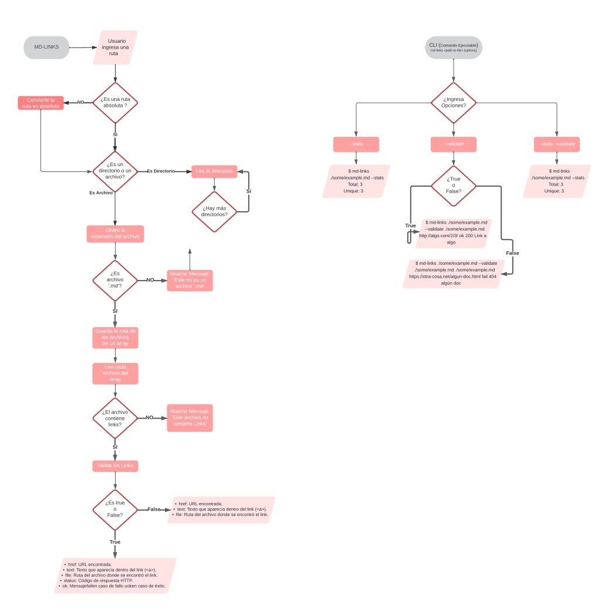

# Markdown Links

## Índice

* [1. Diagrama de flujo](#1-diagrama-de-flujo)
* [2. Resumen del proyecto](#2-resumen-del-proyecto)
* [3. Librerias utilizadas](#3-librerias-utilizadas)
* [4. Lenguajes utilizados](#4-lenguajes-utilizados)
* [5. Pruebas unitarias](#5-pruebas-unitarias)
* [6. Instalación](#6-instalacion)
* [7. Ejemplos implementación lineas de comando](#7-ejemplos-implementacion-lineas-de-comando)
* [8. Opciones](#opciones)
* [9. Creado por](#9-creado-por)

***
## 1. Diagrama de Flujo


## 2. Resumen del proyecto
md-links es una librería que nos permite recorrer y leer directorios y archivos dados por el usuario para extraer los links presentes en los archivos Markdown (.md) y posteriormente analizarlos.

## 3. Librerías utilizadas
 - node-fetch
 - fs
 - path

## 4. Lenguajes utilizados
Este código fue desarrollado con javascript.

## 5. Pruebas unitarias
Se realizaron pruebas unitarias utilizando jest

## 6. Instalación
Ingresa este comando en tu consola de PowerShell o git bash + Enter.
npm install --save https://github.com/gilliam24/BOG004-md-links.git"

## 7. Ejemplos implementación lineas de comando

Ejemplo en Terminal PowerShell: Ingresando md-links + ruta del directorio o archivo a explorar
```sh
PS C:\Users\GILLIAM\Desktop\proyectos\BOG004-md-links>  md-links ./carpetaParaPruebas/archivomd.md
[
  {
    href: 'https://www.mundodeportivo.com/uncomo/tecnologia/articulo/como-compartir-varios-links-en-un-solo-enlace-19945.html',
    text: 'Mundo deportivo',
    file: 'C:\\Users\\GILLIAM\\Desktop\\proyectos\\BOG004-md-links\\carpetaParaPruebas\\archivomd.md',
    status: 200,
    ok: 'OK'
  },
  {
    href: 'https://es.wikipedia.org/wiki/F%C3%BAtbol_sala',
    text: 'Futsal',
    file: 'C:\\Users\\GILLIAM\\Desktop\\proyectos\\BOG004-md-links\\carpetaParaPruebas\\archivomd.md',
    status: 200,
    ok: 'OK'
  }
]
```

Ejemplo en Terminal Bash: Ingresando md-links + ruta del directorio o archivo a explorar
```sh
$  md-links ./carpetaParaPruebas/archivomd.md
[
  {
    href: 'https://www.mundodeportivo.com/uncomo/tecnologia/articulo/como-compartir-varios-links-en-un-solo-enlace-19945.html',  
    text: 'Mundo deportivo',
    file: 'C:\\Users\\GILLIAM\\Desktop\\proyectos\\BOG004-md-links\\carpetaParaPruebas\\archivomd.md',
    status: 200,
    ok: 'OK'
  },
  {
    href: 'https://es.wikipedia.org/wiki/F%C3%BAtbol_sala',
    text: 'Futsal',
    file: 'C:\\Users\\GILLIAM\\Desktop\\proyectos\\BOG004-md-links\\carpetaParaPruebas\\archivomd.md',
    status: 200,
    ok: 'OK'
  }
]
```
## 8. Opciones
--validate: Esta opción nos permite validar los links que estan dentro de los archivos .md
```sh
$  md-links ./carpetaParaPruebas/archivomd.md --validate
validate
 Href:  [
  'C:\\Users\\GILLIAM\\Desktop\\proyectos\\BOG004-md-links\\carpetaParaPruebas\\archivomd.md https://www.mundodeportivo.com/uncomo/tecnologia/articulo/como-compartir-varios-links-en-un-solo-enlace-19945.html OK 200 Mundo deportivo',
  'C:\\Users\\GILLIAM\\Desktop\\proyectos\\BOG004-md-links\\carpetaParaPruebas\\archivomd.md https://es.wikipedia.org/wiki/F%C3%BAtbol_sala OK 200 Futsal'
]
```

--stats: Muestra las estadisticas de los links, el total corresponde al número total de los links encontrados en los archivos md de la ruta correspondiente, y unique corresponde al numero de links contando solo una vez los que estan repetidos.
```sh
$  md-links ./carpetaParaPruebas/archivomd.md --stats
 Total:  2 
 Unique:  2
```

--validate --stats: Esta opción combinada nos muestra las estadisticas y además nos muestra los broken, que corresponde al número de links rotos que encuentra.
```sh
$  md-links ./carpetaParaPruebas/archivomd.md --validate --stats
 Total:  2 
 Unique:  2
 Broken:  1
```

## 9. Creado por
Gilliam Argel Monterroza [Gilliam Argel] :space_invader:


